# Shullow - Architecture Documentation

## Overview

Shullow is a Manifest V3 Chrome extension that injects custom Points of Interest (POI) markers onto real estate map websites. The architecture separates the browser context (content scripts) from the page context (bridge injection) via `window.postMessage` and DOM attribute mirroring.

## Two-World Architecture

```mermaid
graph TB
    subgraph BG["Browser Context"]
        Popup["🖱️ Popup UI<br/>popup.js"]
        Storage["💾 Chrome Storage"]
    end
    
    subgraph Content["Content World<br/>(Isolated)"]
        Gate["entry-gate.js<br/>document_start"]
        MainContent["main.js<br/>Boot & Stability Loop"]
        State["POIStateManager<br/>Storage Interface"]
        Events["EventManager<br/>Relay Messages"]
        Overlay["OverlayManager<br/>DOM Overlay"]
    end
    
    subgraph Bridge["Main World<br/>(Page Context)"]
        BridgeMain["bridge/main.js<br/>Orchestration Loop"]
        Hijack["MapHijackManager<br/>Constructor Interception"]
        Discovery["MapDiscoveryManager<br/>Map Detection"]
        Portal["PortalManager<br/>Bounds Priority"]
        Registry["OverlayRegistry<br/>Map Isolation"]
        Renderer["poiRenderer<br/>Native Markers"]
    end
    
    MapEngine["🗺️ Map Engines<br/>Google Maps / Mapbox"]
    
    Popup -->|runtime.onMessage| Events
    Storage -->|onChanged| Events
    Storage <-->|get/set| State
    
    Gate -->|Check enabled?| State
    MainContent -->|Inject bridge| Bridge
    MainContent -->|postMessage| Events
    
    State -->|POI array| Events
    Events -->|postMessage| BridgeMain
    Events -->|Render overlay| Overlay
    
    BridgeMain -->|Initialize| Hijack
    BridgeMain -->|Run loop| Discovery
    BridgeMain -->|Extract bounds| Portal
    BridgeMain -->|Render POIs| Renderer
    
    Hijack -->|Intercept| MapEngine
    Discovery -->|Find maps| MapEngine
    Portal -->|Report bounds| Events
    Registry -->|Register/cleanup| Bridge
    Renderer -->|Native markers| MapEngine
```



## Message Protocol

Communication between worlds uses JSON messages via `window.postMessage()` and Chrome runtime messages.

### Bridge → Content (via postMessage)

| Message | Direction | Source | Purpose |
|---------|-----------|--------|---------|
| `POI_BRIDGE_READY` | Bridge→Content | bridge/main.js | Bridge loaded and ready for POI data |
| `POI_BOUNDS_UPDATE` | Bridge→Content | portal.js | Map viewport bounds changed (for debug overlay) |
| `POI_MARKER_CLICK` | Bridge→Content | renderer.js | User clicked a POI marker |
| `POI_MARKER_HOVER` | Bridge→Content | renderer.js | Mouse entered a marker |
| `POI_MARKER_LEAVE` | Bridge→Content | renderer.js | Mouse left a marker |
| `POI_DATA_UPDATE` | Content→Bridge | events.js | New POI array to render |

### Popup → Content (via chrome.runtime.onMessage)

| Message | Target | Parameters | Purpose |
|---------|--------|------------|---------|
| `update-active-groups` | Content script | `activeGroups`, `preferences`, `styleChangedGroup` | Toggle POI groups on/off |
| `refresh-pois` | Content script | `preferences` | Force refresh of POI data |
| `toggle-site-enabled` | Content script | `enabled`, `preferences` | Enable/disable extension for current site |

### Storage Changes (via chrome.storage.onChanged)

Content script listens for changes to:
- `poiGroups` — POI data (uuid → {name, pois[]})
- `activeGroups` — Toggle states (uuid → boolean)
- `preferences` — User settings (sitePreferences, groupStyles, accentColor, etc.)

## Storage Schema

```javascript
chrome.storage.local = {
  poiGroups: {
    [uuid]: {
      name: string,
      pois: POI[]  // [{latitude, longitude, name, address, ...}, ...]
    },
    ...
  },
  
  activeGroups: {
    [uuid]: boolean,  // true = visible, false = hidden
    ...
  },
  
  preferences: {
    overlayEnabled: boolean,
    debugEnabled: boolean,
    accentColor: string,  // hex color, e.g. '#d1ff00'
    sitePreferences: {
      [hostname]: {
        siteEnabled: boolean,
        overlayEnabled: boolean
      },
      ...
    },
    groupStyles: {
      [uuid]: {
        color: string,          // primary marker color
        secondaryColor: string, // secondary/accent color
        logoData: string | null // base64 data URI or null
      },
      ...
    }
  },
  
  _uuidMigrated: boolean  // Version flag for UUID migration
}
```

## Startup Sequence

```
1. Page Load
   ↓
2. content/entry-gate.js (document_start)
   ├─ Check chrome.storage for siteEnabled[hostname]
   ├─ If enabled: inject bridge/bridge-bundle.js into MAIN world
   └─ If disabled: skip injection

3. bridge/bridge-bundle.js loads in MAIN world
   ├─ Import bridge/modules/*.js (in dependency order)
   ├─ Start bridge/main.js loop (500ms interval)
   └─ Announce POI_BRIDGE_READY via postMessage

4. content/main.js (document_end)
   ├─ Create POIStateManager singleton
   ├─ Check if site enabled
   │  ├─ If yes: call bootExtension()
   │  └─ If no: set __poiDormant flag, wait for storage change
   └─ bootExtension():
       ├─ Start stability loop (250ms)
       │  └─ Call MapDetector.detectContainer()
       │  └─ Create/update OverlayManager if container found
       └─ Register bridge event listeners

5. bridge/main.js loop begins
   ├─ Initialize ManagerBase singletons
   ├─ Hijack google.maps.Map and mapboxgl.Map constructors
   ├─ Run MapDiscoveryManager to find existing maps
   ├─ Register maps with OverlayRegistry (domain locked)
   ├─ Extract bounds and call PortalManager.update()
   └─ Render POIs via poiRenderer

6. POI data flows
   ├─ Content script: POIStateManager.refresh()
   ├─ postMessage({ type: 'POI_DATA_UPDATE', pois: [...] })
   └─ Bridge: poiRenderer.update(pois)
       └─ Render native Google Maps/Mapbox markers
```

## Core Modules

### content/entry-gate.js
**Earliest injection point** (document_start).

- Skips iframes
- Reads `chrome.storage` for `siteEnabled` preference
- Injects `bridge/bridge-bundle.js` if enabled (via `chrome.runtime.getURL()`)
- Fails open on storage errors

### content/main.js
**Content script orchestrator** (document_end).

Initializes `POIStateManager`, checks if site is enabled, and calls `bootExtension()` to start the stability loop.

### content/modules/state.js
**POIStateManager** - Chrome storage interface.

```javascript
class POIStateManager {
  activeGroups = {};           // uuid → boolean (active state)
  preferences = { ... };       // User settings
  _poiCache = null;            // Cached POI array
  _globalBounds = null;        // Last reported viewport bounds
  
  async refresh() {
    // Load active groups & POI data from storage
    // Filter POIs by active groups
    // Send POI_DATA_UPDATE to bridge
  }
}
```

### content/modules/events.js
**EventManager** - Central event hub.

Listens to:
- `chrome.runtime.onMessage` (popup commands)
- `chrome.storage.onChanged` (cross-tab sync)
- `window.postMessage` (bridge events)

Routes:
- Group toggles → POIStateManager.refresh()
- Storage changes → invalidate cache, trigger refresh
- Bridge bounds → OverlayManager.extractBounds()
- Marker clicks/hovers → OverlayManager handlers

### content/modules/overlay.js
**OverlayManager** - DOM overlay and debug panel.

```javascript
class OverlayManager {
  container = null;           // Map container element
  overlay = null;             // Transparent overlay div
  debugPanel = null;          // Debug info panel
  
  updateVisibility() { ... }  // Show/hide based on site+debug toggles
  handleNativeClick(id, lat, lng) { ... }  // Show marker details
}
```

### bridge/modules/ManagerBase.js
**Abstract singleton base class** for all bridge managers.

```javascript
class ManagerBase {
  static instance = null;
  initialized = false;
  
  constructor() {
    if (this.constructor.instance) return this.constructor.instance;
    this.constructor.instance = this;
  }
  
  async initialize() { /* idempotent */ }
  cleanup() { /* override in subclasses */ }
}
```

All managers (`MapHijackManager`, `MapDiscoveryManager`, `PortalManager`) extend this.

### bridge/modules/hijack.js
**MapHijackManager** - Constructor interception.

- Replaces `google.maps.Map` constructor with wrapper that captures instances
- Replaces `mapboxgl.Map` constructor
- Attaches event listeners:
  - Google: `'idle'`, `'moveend'`, `'zoom_changed'` → `PortalManager.update(bounds, 'instance-event')`
  - Mapbox: `'moveend'`, `'idle'`, `'zoom'` → same
- Stores active maps in `Set` for polling

### bridge/modules/discovery.js
**MapDiscoveryManager** - Multi-strategy map detection.

Discovers maps via (in order):
1. Mapbox global registry (`mapboxgl._instances`)
2. Web components (`gmp-map`, `gmp-advanced-marker`)
3. React Fiber tree walking (`__reactFiber` props)
4. Shadow DOM traversal
5. DOM selectors (from siteConfig.js)

Each discovered map → `OverlayRegistry.register()`

### bridge/modules/portal.js
**PortalManager** - Bounds prioritization and cross-world communication.

Maintains priority queue:
```javascript
PRIORITIES = {
  'instance-event': 100,      // User interaction (drag/zoom)
  'redfin-redux-sub': 90,    // Real-time data source
  'redfin-api': 85,          // API response
  'instance-capture': 80,     // Extracted from map state
  'redfin-redux': 50,        // Polled state
  'redfin-global': 40        // Polled global variable
}
```

Only fresher data overwrites `lastBounds`. Mirrors to DOM:
```javascript
documentElement['data-poi-bounds'] = JSON.stringify({
  north, south, east, west
})
```

Content script detects change and triggers refresh.

### bridge/modules/renderer.js
**poiRenderer** - Native marker rendering engine.

```javascript
window.poiRenderer = {
  activeMarkers = new Map(),    // id → NativeMarker
  lastPoiData = [],
  
  update(pois) {
    // For each active map instance:
    // - Google: use PoiBatchOverlay (single overlay for all markers)
    // - Mapbox: create mapboxgl.Marker per POI
  }
}
```

Google Maps uses element pooling; Mapbox uses direct marker creation.

### overlays/siteConfig.js
**SiteConfigManager** - Centralized site configuration.

```javascript
SITE_CONFIG = {
  'zillow.com': {
    displayName: 'Zillow',
    mapType: 'mapbox',
    selectors: ['.mapboxgl-map', '#search-page-map', ...],
    styles: { markerZIndex: 103, markerHoverZIndex: 1000000, ... },
    features: {
      reduxStore: false,
      shadowDOM: false,
      boundsTracking: true
    }
  },
  'redfin.com': { ... },
  'realtor.com': { ... },
  'homes.com': { ... },
  'onekeymls.com': { ... },
  'default': { ... }
}
```

Each site entry provides:
- **displayName** — User-friendly name
- **mapType** — `'google'`, `'mapbox'`, or `'auto'`
- **selectors** — DOM selectors for container detection
- **styles** — z-index, opacity, size overrides
- **features** — Redux integration, Shadow DOM, etc.

### overlays/OverlayRegistry.js
**Multi-map isolation** (Phase 6.5).

Problem: Iframes and ads can have their own maps; global domain detection fails.

Solution:
```javascript
class MapEntry {
  constructor(id, mapInstance, domain, siteConfig) {
    Object.defineProperty(this, 'domain', {
      value: domain,
      writable: false  // Immutable
    });
    this.mapInstance = mapInstance;
    this.siteConfig = siteConfig;
  }
}

class OverlayRegistry {
  entries = new Map();         // Map<mapId, MapEntry>
  instanceToId = new WeakMap(); // map instance → unique id
  
  register(mapInstance, containerElement) {
    // Extract domain once
    // Create immutable MapEntry
    // Register with unique ID
  }
}
```

- Each map gets unique `id`
- Domain is locked and immutable per map
- Site config cannot change after registration
- Prevents ads/iframes from polluting main map settings

## Data Flow Example

**User zooms on Zillow; markers update:**

```
1. User zooms Zillow map (Mapbox GL JS)

2. Map fires 'moveend' event

3. MapHijackManager listener:
   PortalManager.update({north, south, east, west}, 'instance-event')
   
4. PortalManager checks priority (100 > previous):
   documentElement['data-poi-bounds'] = '{"north":40.8...}'

5. content/events.js detects DOM attribute change:
   POIStateManager.refresh()
   
6. refresh() reads:
   - activeGroups from memory
   - poiGroups from storage
   - preferences.groupStyles
   
7. Builds POI array (filtered to viewport):
   [{id: 'poi-1', lat, lng, name, color, secondaryColor, logoData}, ...]
   
8. Sends to bridge:
   window.postMessage({
     type: 'POI_DATA_UPDATE',
     pois: [...]
   }, '*')

9. bridge/main.js loop receives in window.addEventListener('message'):
   lastReceivedPois = event.data.pois
   
10. Loop calls poiRenderer.update(lastReceivedPois):
    - For each active map instance from MapHijackManager.activeMaps:
      - Get siteConfig (from OverlayRegistry)
      - Google Maps: create/reuse markers in PoiBatchOverlay
      - Mapbox: create mapboxgl.Marker per POI
      
11. Markers rendered on map
```

## Design Patterns

### Singleton Pattern (ManagerBase)
All bridge managers enforce single instances via constructor guard:
```javascript
if (this.constructor.instance) return this.constructor.instance;
this.constructor.instance = this;
```

### Priority-Based State Locking
PortalManager prevents stale data from overwriting fresh bounds using priority queues. High-priority sources (≥80) lock out low-priority updates for 5 seconds.

### Constructor Hijacking
Transparently intercept map library constructors to capture instances without modifying page code:
```javascript
const OrigMap = window.google.maps.Map;
window.google.maps.Map = function(...args) {
  const instance = new OrigMap(...args);
  MapHijackManager.activeMaps.add(instance);
  return instance;
};
```

### Domain Immutability (Phase 6.5)
Once a map is registered, its domain is locked via `Object.defineProperty`:
```javascript
Object.defineProperty(mapEntry, 'domain', {
  value: extractedDomain,
  writable: false
});
```

Prevents ads/iframes from changing map assignments.

### Batch Rendering
Google Maps uses single `PoiBatchOverlay` (extends `google.maps.OverlayView`) with element pooling instead of one overlay per marker, reducing DOM nodes and improving performance.

### Dormant/Boot Pattern
Sites loaded with extension disabled remain dormant. When toggled on via popup, `bootExtension()` is called without page reload to activate the stability loop.

### Element Pooling (MarkerPool)
```javascript
class MarkerPool {
  pool = [];
  maxSize = 100;
  
  get() { return pool.length > 0 ? pool.pop() : document.createElement('div'); }
  release(el) { if (pool.length < maxSize) pool.push(el); }
}
```

Reuses marker DOM elements to avoid constant creation/destruction.

## Performance Notes

- **500ms loop interval** in bridge/main.js balances responsiveness with CPU usage
- **250ms stability loop** in content/main.js detects container changes without thrashing
- **50ms debounce** on storage refresh events prevents cascading updates
- **5-minute cleanup** cycle in OverlayRegistry removes stale DOM references
- **Element pooling** caps DOM at ~100 marker elements max
- **Priority locking** (5 second window) prevents low-quality data sources (polled state) from overwriting high-quality sources (user interaction)

## Known Limitations


- `options/options.js` is not implemented (placeholder)
- `background.js` is empty — no service worker logic currently
- Popup version still displays `v0.2` while manifest is `v0.3` (should be updated separately)

## Version History

- **v0.3** - Rewritten docs from source, domain isolation via OverlayRegistry
- **v0.2** - Site config consolidation
- **v0.1** - Initial bridge-based architecture

## License

MIT
