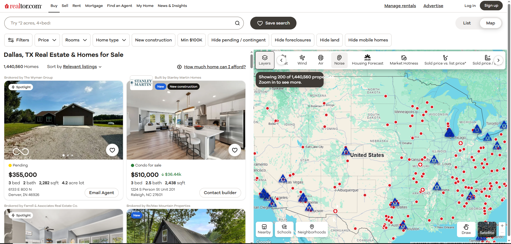

# Shullow

Chrome extension that injects custom Points of Interest (POI) markers onto real estate map websites using native map APIs.

## Features

- CSV/JSON import of POI data
- Per-group customization: primary/secondary colors, custom logo icons
- Per-site enable/disable toggle
- Global debug overlay
- Theme accent color control
- Import/export of group data with embedded styles
- Supports multiple maps on same page (domain isolation)

## Supported Sites

- **Zillow** - Mapbox GL JS
- **Redfin** - Google Maps with Redux support
- **Realtor.com** - Auto-detection (Google or Mapbox)
- **Homes.com** - Google Maps
- **OneKey MLS** - Mapbox GL JS
- **Generic** - Any site with Google Maps or Mapbox GL JS

## Installation

1. Clone the repository and navigate to it:
   ```bash
   git clone https://github.com/ericshermancs/Shullow.git
   cd Shullow
   ```

2. Install dependencies:
   ```bash
   npm install
   ```

3. Build the bridge bundle:
   ```bash
   npm run build:bridge
   ```

4. Open Chrome and go to `chrome://extensions/`

5. Enable "Developer mode" (top right toggle)

6. Click "Load unpacked" and select the project folder

## Usage

1. Visit a supported real estate site
2. Click the Shullow extension icon
3. In the popup:
   - **Create a group**: Enter a name and upload a CSV or JSON file with POI data
   - **Customize**: Click the pin icon to adjust colors and upload custom logo images
   - **Toggle**: Click the checkbox next to each group to show/hide its markers
   - **Export/Import**: Use the EXPORT button to save groups as JSON, or upload previously exported files
4. Toggle "OVERLAY FOR SITE" to enable/disable markers on the current page
5. Customize the plugin accent color under "PLUGIN THEME"

### CSV Format

Minimum required fields: `latitude`, `longitude`, `name`

Example:
```csv
latitude,longitude,name,address
40.7128,-74.0060,Times Square,42nd Street NYC
40.7580,-73.9855,Empire State,350 5th Avenue
```

Alternative field names are supported: `lat`/`lng`, `place_name`, etc.

#### Multi-Group CSV Import

Load multiple groups from a single CSV file by including a `shullow group` field (also accepts `shullow_group`, `shullow group name`, or `shullow_group_name`):

```csv
latitude,longitude,name,address,shullow group
40.7128,-74.0060,Times Square,42nd Street NYC,Landmarks
40.7580,-73.9855,Empire State,350 5th Avenue,Landmarks
40.6892,-74.0445,Statue of Liberty,Liberty Island,Monuments
40.7489,-73.9680,Grand Central,42nd Street,Transit
```

When a CSV contains the `shullow group` column, Shullow automatically:
- Creates a separate group for each unique value in that column
- Assigns each POI to its corresponding group
- Applies a random color to each new group (matching the icon colors used for markers)

In the example above, three groups would be created: "Landmarks", "Monuments", and "Transit".

### JSON Format

Array of objects with the same fields as CSV:
```json
[
  {"latitude": 40.7128, "longitude": -74.0060, "name": "Times Square"},
  {"latitude": 40.7580, "longitude": -73.9855, "name": "Empire State"}
]
```

#### Multi-Group JSON Import

JSON files also support multi-group loading using a `groupName` field:

```json
[
  {"latitude": 40.7128, "longitude": -74.0060, "name": "Times Square", "address": "42nd Street NYC", "groupName": "Landmarks"},
  {"latitude": 40.7580, "longitude": -73.9855, "name": "Empire State", "address": "350 5th Avenue", "groupName": "Landmarks"},
  {"latitude": 40.6892, "longitude": -74.0445, "name": "Statue of Liberty", "address": "Liberty Island", "groupName": "Monuments"},
  {"latitude": 40.7489, "longitude": -73.9680, "name": "Grand Central", "address": "42nd Street", "groupName": "Transit"}
]
```

This produces the same result as the multi-group CSV example: three automatically-created groups with POIs distributed accordingly.

## Gallery

### Map Overlay Examples

Experience Shullow across different real estate platforms:

#### Zillow - Columbus Area with GoDaven POI Data

*Custom Shullow POI markers with custom pop-up information from your CSV files*

#### Homes.com - Flushing with Shullow Overlay

*Shullow extension plugin menu. Control the plugin theme, add groups, rename them, customize them!*

#### Realtor.com - US Young Israel Listing

*Custom icons for your Shullow POI groups so you can distinguish between them easily at any zoom level*

#### Airbnb - Cancun with GoDaven Data

*Demonstrating generic map support extending beyond real estate sites, like if you need to find an AirBNB in Cancun within walking distance to a minyan on Shabbat*


## Architecture

See [ARCHITECTURE.md](ARCHITECTURE.md) for detailed technical documentation.

## License

MIT
